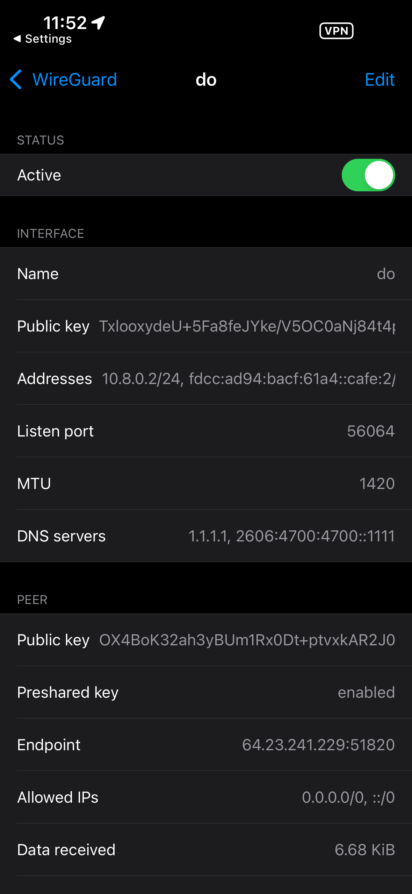
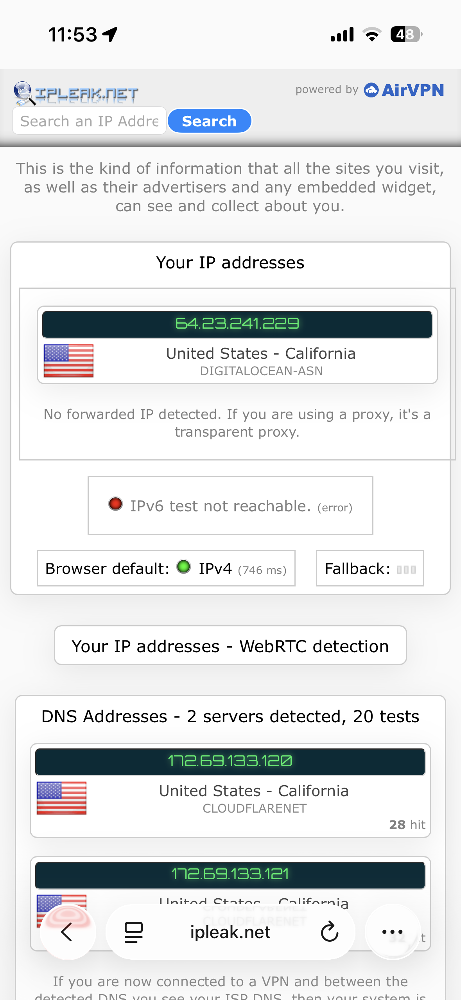

# CYB-3353 Lab 3 – WireGaurd inside Docker

## Process
In this lab, I am expected to:

1. Create a VPS (Virtual Private Server) inside a DigitalOcean droplet
2. Install Docker inside the server
3. Install WireGaurd
4. Connect to VPN

## Step 1
I created a DigitalOcean account using the link provided. Unfortunatley, I got charged twice for this, which never got refunded. I created a simple droplet using the cheapest options on an Ubuntu server.

## Step 2
I used the DigitalOcean online shell to interface with the OS. Once inside, I was able to run Docker's one-liner:
```bash
curl -sSL https://get.docker.com | sh
```
This installed the `docker-engine`.

## Step 3
I found a project called [wg-easy](https://github.com/wg-easy/wg-easy/) that allowed for easy connection and installation of WireGaurd. This is the provided `docker-compose.yml`:
```yaml
volumes:
  etc_wireguard:

services:
  wg-easy:
    #environment:
    #  Optional:
    #  - PORT=51821
    #  - HOST=0.0.0.0
    #  - INSECURE=false

    image: ghcr.io/wg-easy/wg-easy:15
    container_name: wg-easy
    networks:
      wg:
        ipv4_address: 10.42.42.42
        ipv6_address: fdcc:ad94:bacf:61a3::2a
    volumes:
      - etc_wireguard:/etc/wireguard
      - /lib/modules:/lib/modules:ro
    ports:
      - "51820:51820/udp"
      - "51821:51821/tcp"
    restart: unless-stopped
    cap_add:
      - NET_ADMIN
      - SYS_MODULE
      # - NET_RAW # ⚠️ Uncomment if using Podman
    sysctls:
      - net.ipv4.ip_forward=1
      - net.ipv4.conf.all.src_valid_mark=1
      - net.ipv6.conf.all.disable_ipv6=0
      - net.ipv6.conf.all.forwarding=1
      - net.ipv6.conf.default.forwarding=1

networks:
  wg:
    driver: bridge
    enable_ipv6: true
    ipam:
      driver: default
      config:
        - subnet: 10.42.42.0/24
        - subnet: fdcc:ad94:bacf:61a3::/64
```
I had to modify the environment and change `INSECURE=false` to `true` to get access to the WebUI, as it won't accept a password over HTTP for obvious reasons. Since this will be destoryed in a minute, I didn't feel it was worth it to set up HTTPS. Once that was configured, I could log into the Web UI and set it up:


## Step 4
`wg-easy` made it easy to create a client for both my laptop and phone, and provided profiles for each. It even included a scannable QR code for my phone. I was able to easily connect with no problems on my laptop:

As well as on my iPhone:



## Epilogue
Once a connection was verified, I destroyed the Droplet to prevent any further charges.
